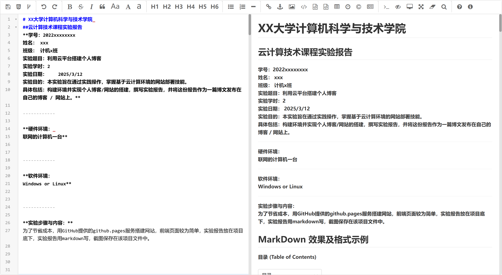
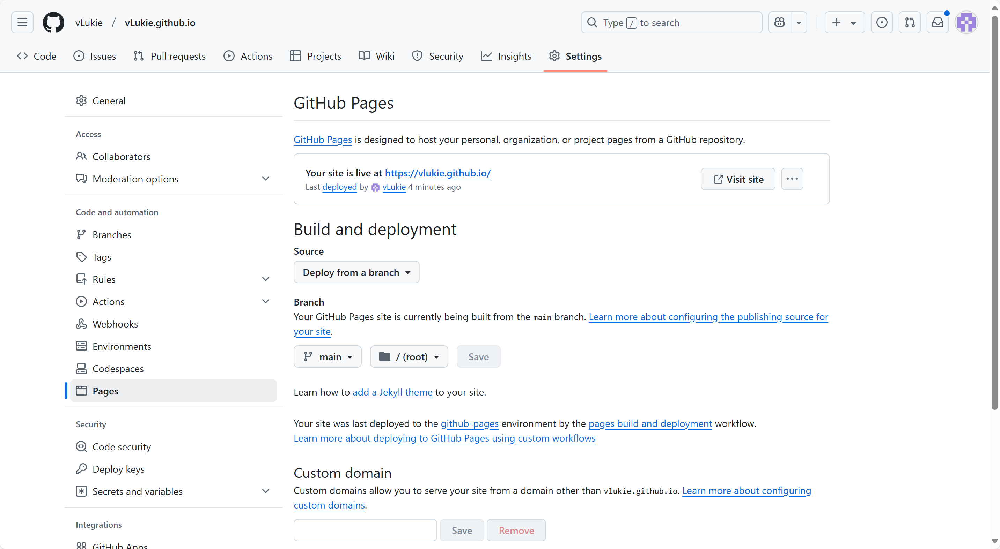

# XX大学计算机科学与技术学院 
##云计算技术课程实验报告
**学号：2022xxxxxxxx
姓名： xxx
班级： 计机x班
实验题目：利用云平台搭建个人博客
实验学时：2
实验日期：    2025/3/12
实验目的：本实验旨在通过实践操作，掌握基于云计算环境的网站部署技能。
具体包括：构建环境并实现个人博客/网站的搭建，撰写实验报告，并将这份报告作为一篇博文发布在自己的博客 / 网站上。**

------------

**硬件环境： 
联网的计算机一台**

------------

**软件环境：
Windows or Linux**

------------

**实验步骤与内容：**

